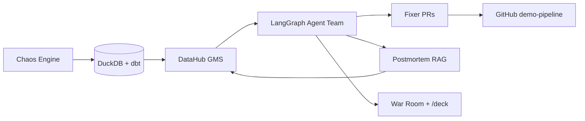

# Kavach

[](https://github.com/doPrashams/kavach/actions/workflows/ci.yml)


**Self-healing data platform** — AI agents on DataHub's context graph detect, diagnose, fix,
and learn from data incidents automatically.

> Your data platform breaks at 2am. Kavach is the war room that resolves it before the
> dashboard turns red.

**Live demo:** [https://kavach-self.vercel.app](https://kavach-self.vercel.app)  
**DataHub UI (self-hosted VM):** [http://34.60.67.85:9002](http://34.60.67.85:9002) (may be offline outside demos — use replay mode)

**Two domains, one agent team:**
| Domain | Stakes | Live data probe |
|--------|--------|-----------------|
| **Systems** | Retail / ops / ML reliability | [NYC TLC Yellow Taxi](https://data.cityofnewyork.us/Transportation/2018-Yellow-Taxi-Trip-Data/t29m-gskq/about_data) |
| **Humans** | PHI governance / clinical quality | [Synthea synthetic patients](https://synthetichealth.github.io/synthea/) (no real PHI) |

Toggle **Systems | Humans** in the war-room header. Atlas (“How Kavach works”) lists both above the stack. Site tour step 0 explains the dual frame.

Record a demo GIF per [`docs/VIDEO.md`](docs/VIDEO.md) for Devpost.

## Quickstart (60 seconds)

```bash
# Backend API + agents (StubLLM — no API keys)
cd backend && uv sync --extra dev && uv run uvicorn app.main:app --reload

# Frontend war room (new terminal)
cd frontend && pnpm install && pnpm dev

# Full stack: MLflow + backend
cp deploy/.env.example deploy/.env
docker compose -f deploy/docker-compose.yml up --build

# Seed demo + replay recordings (offline)
./deploy/scripts/seed_demo.sh
```

- Backend: http://localhost:8000/health
- War room: http://localhost:3000
- Deck: http://localhost:3000/deck
- **Replay:** pick any scenario in the UI — zero API keys required

## Architecture



Full diagram: [`docs/ARCHITECTURE.md`](docs/ARCHITECTURE.md)

## How Kavach uses DataHub

| DataHub capability | Where used | Evidence |
|--------------------|------------|----------|
| **Lineage** (table + column) | Investigator, Impact Analyst, blast-radius graph | [`backend/app/datahub/service.py`](backend/app/datahub/service.py) |
| **ML entities** (`dataset → mlFeature → mlModel → mlModelDeployment`) | ML Guardian hold/safeguard | [`ml/lineage.py`](ml/lineage.py), [`examples/risk_reports/`](examples/risk_reports/) |
| **Query history** | Investigator root-cause ranking | [`data/fixtures/queries.json`](data/fixtures/queries.json) |
| **Incidents** | Sentinel open → Scribe resolve | [`backend/app/agents/nodes/sentinel.py`](backend/app/agents/nodes/sentinel.py) |
| **Assertions** | Sentinel detect + Fixer safeguard | [`examples/assertions/`](examples/assertions/) |
| **Context Documents** (read + write) | Flywheel RAG + Scribe postmortem | [`backend/app/flywheel/`](backend/app/flywheel/) |
| **Glossary / ownership** | Comms notifications | [`backend/app/agents/nodes/comms.py`](backend/app/agents/nodes/comms.py) |
| **Analytics Agent** | Natural-language catalog Q&A | [`backend/app/analytics/`](backend/app/analytics/) |
| **MCP Server** | Live JSON-RPC tool calls when `DATAHUB_GMS_URL` set | [`backend/app/datahub/mcp.py`](backend/app/datahub/mcp.py) |

Live when `DATAHUB_GMS_URL` is set; otherwise fixtures + committed replay recordings power offline demos.

> **Ask DataHub / Cloud Analytics:** DataHub Cloud’s managed Ask DataHub product is
> **Cloud-only** and out of scope for the OSS claim. Kavach’s war-room “Ask DataHub”
> panel is a fixture/MCP-backed Analytics Agent demo, not the Cloud product.

## Hackathon categories claimed

| Category | Claim | Evidence |
|----------|-------|----------|
| **Cat 1 — Agentic workflow** | 7-agent LangGraph team with SSE war room | [`backend/app/agents/`](backend/app/agents/), [`frontend/components/WarRoom.tsx`](frontend/components/WarRoom.tsx) |
| **Cat 2 — Data quality** | Chaos scenarios + Fixer PRs + assertions | [`backend/app/chaos/`](backend/app/chaos/), [`examples/prs/`](examples/prs/) |
| **Cat 3 — ML lineage** | Demand forecast model + deployment hold | [`ml/`](ml/), [`examples/risk_reports/value_corruption.md`](examples/risk_reports/value_corruption.md) |
| **Cat 4 — Knowledge flywheel** | Postmortem RAG lowers MTTR on repeat incidents | [`backend/app/flywheel/`](backend/app/flywheel/), [`examples/mttr_report.json`](examples/mttr_report.json) |

**Bonus — OSS contribution:** [`skills/datahub-incident-response/`](skills/datahub-incident-response/) → upstream PR guide in [`docs/handoffs/H10-skill-pr/SUBMIT.md`](docs/handoffs/H10-skill-pr/SUBMIT.md)

## MTTR flywheel results

On the StubLLM path, repeat `schema_drift` agent processing drops **15×** when a prior
postmortem is cited (3.0s → 0.2s, **measured** from `processing_ms`). Comparison to a
**30-minute human baseline** is **modeled** — see honesty fields in
[`examples/mttr_report.json`](examples/mttr_report.json) and the war-room MTTR chart.

## Fixer PRs (demo-pipeline)

| Scenario | Status | Link / artifact |
|----------|--------|-----------------|
| `value_corruption` | Merged PR | [#1](https://github.com/doPrashams/kavach-demo-pipeline/pull/1) |
| `schema_drift` | Dry-run artifact | [`examples/prs/schema_drift/`](examples/prs/schema_drift/) |
| `null_spike` | Dry-run artifact | [`examples/prs/null_spike/`](examples/prs/null_spike/) |
| `freshness_lag` | Dry-run artifact | [`examples/prs/freshness_lag/`](examples/prs/freshness_lag/) |

Live PRs target [`doPrashams/kavach-demo-pipeline`](https://github.com/doPrashams/kavach-demo-pipeline).
Additional Fixer opens need `GITHUB_PAT` (see [`docs/handoffs/H26-fixer-prs-media/STATUS.md`](docs/handoffs/H26-fixer-prs-media/STATUS.md)).

## Replay (zero API keys)

```bash
curl http://localhost:8000/recordings
curl -X POST http://localhost:8000/replay/chaos_value_corruption_seed42
```

Recordings: [`backend/app/events/recordings/`](backend/app/events/recordings/)

## Judge-facing outputs (no runtime required)

| Output | Path |
|--------|------|
| Fixer PRs (4 scenarios) | [`examples/prs/`](examples/prs/) |
| Postmortems | [`examples/postmortems/`](examples/postmortems/) |
| Assertions | [`examples/assertions/`](examples/assertions/) |
| ML risk reports | [`examples/risk_reports/`](examples/risk_reports/) |
| MTTR report | [`examples/mttr_report.json`](examples/mttr_report.json) |

## Docs

- [Judging criteria map](docs/JUDGING.md)
- [Video script + shot list](docs/VIDEO.md)
- [Devpost description](docs/DEVPOST.md)
- [VM deploy runbook](deploy/README.md)
- [Vercel deploy steps](deploy/VERCEL.md)

## License

Apache 2.0 — see [LICENSE](LICENSE).
