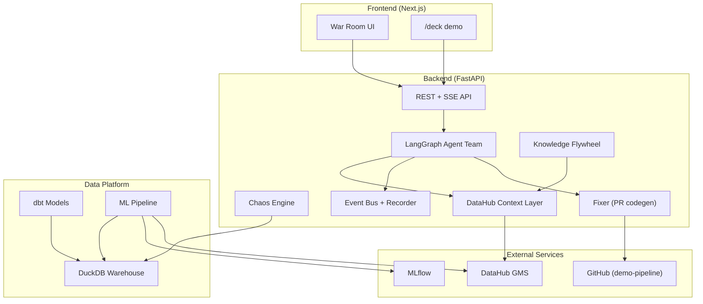

# Kavach Architecture

Kavach is a self-healing data platform where AI agents operate on DataHub's context graph
to detect, investigate, and remediate data incidents.

## System diagram

## Components

| Component | Role |
|-----------|------|
| **Backend** | FastAPI app exposing health, SSE streams, and agent orchestration |
| **Agents** | LangGraph team (Sentinel, Investigator, Fixer, ML Guardian, etc.) |
| **Chaos** | Injects realistic failures into the data platform for demo |
| **DataHub layer** | Typed context service over MCP + Agent Context Kit |
| **Frontend** | War room UI with React Flow graphs and `/deck` animations |
